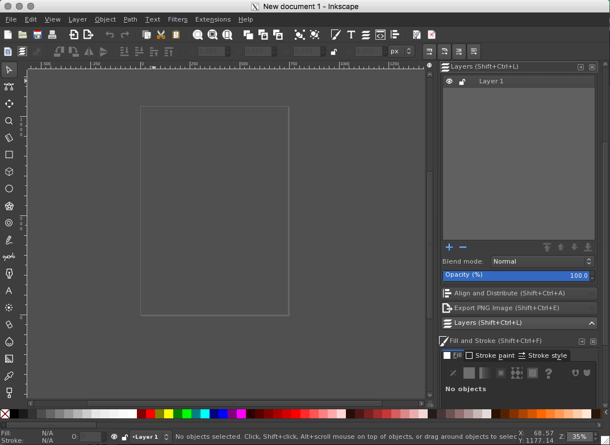

# Customizing Inkscape

If you find that Inkscape's default bright white theme sears your retinas, here are some tricks for darkening the theme, and modernizing the icons while you're at it. This works on macOS. You can also make this work on a PC, but the paths for the files are going to be different, so you'll have to look around a bit, or follow this guide from [Logos by Nick](https://logosbynick.com/how-to-make-inkscape-go-dark/). If you're using Linux just google `inkscape dark theme` -- there's a much easier solution out there for Linux.

## Tool Areas

Navigate to 

```
/Applications/Inkscape.app/Contents/Resources/etc/
```

and replace the `gtk-2.0` directory with the one in this repo. This will make all of your tool areas a very dark grey.  

I excavated this directory out of a zipped exe file from [byJohnny, LLC](http://byjohnny.com/).  

## Workspace Background

You'll still have a blinding white workspace, so let's fix that.

You can change the background on a per-document basis here:

```
File -> Document Properties -> Page tab -> Display
```

Click the checkerboard bar to change the color of the background.

If you want this to be your new default for all documents open

```
/Applications/Inkscape.app/Contents/Resources/share/inkscape/template/default.svg
```

and make the change there and save. Any change you make to this default file will become your new default for all documents. You can also set different page sizes, landscape, rearrange your toolbars into your desired configuration, etc.

## The Icons

The icons aren't going to look great on the dark theme, and anyway they're pretty dated, so let's replace them. Inkscape comes with a pack of simplified monochrome icons, but there's no way to set them from within the app, so you'll have to move files around, instead.

The icons that are displayed are whatever is in the `icons.svg` file in this directory:

```
/Applications/Inkscape.app/Contents/Resources/share/inkscape/icons/
```

If you don't want to muck around editing an icon file, just grab the `icons_custom_holly.svg` file in this repo and rename it to `icons.svg` and drop it in that directory (after saving a backup copy of your `icons.svg` file, of course).

This custom file is a mash up of the `symbolic_icons.svg` file that ships with Inkscape and can be found in the above directory, and some slick, even more modernized icons from Nick Saporito of [Logos by Nick](https://logosbynick.com/new-icons-for-inkscape/).

Nick only has replacements for the sidebar icons, so the rest in the custom file are from the `symbolic_icons.svg` file. The symbolic icons needed to be lightened to appear against the dark background, and if you open the file you can see how to do that (and you can make them a color if you want). Since you can edit SVG files, you can make changes to the icons and add new ones. In fact the symbolic file is missing a few icons so I've replaced most of the missing ones in my custom file so you'll get fewer placeholders.

Inkscape needs to know which icons go where in the UI, and this is handled through Object Properties. Select an icon and navigate to Object -> Object Properties. The ID is the reference used, so if you make or replace an icon, make sure you keep the ID so it gets put in the right place.
